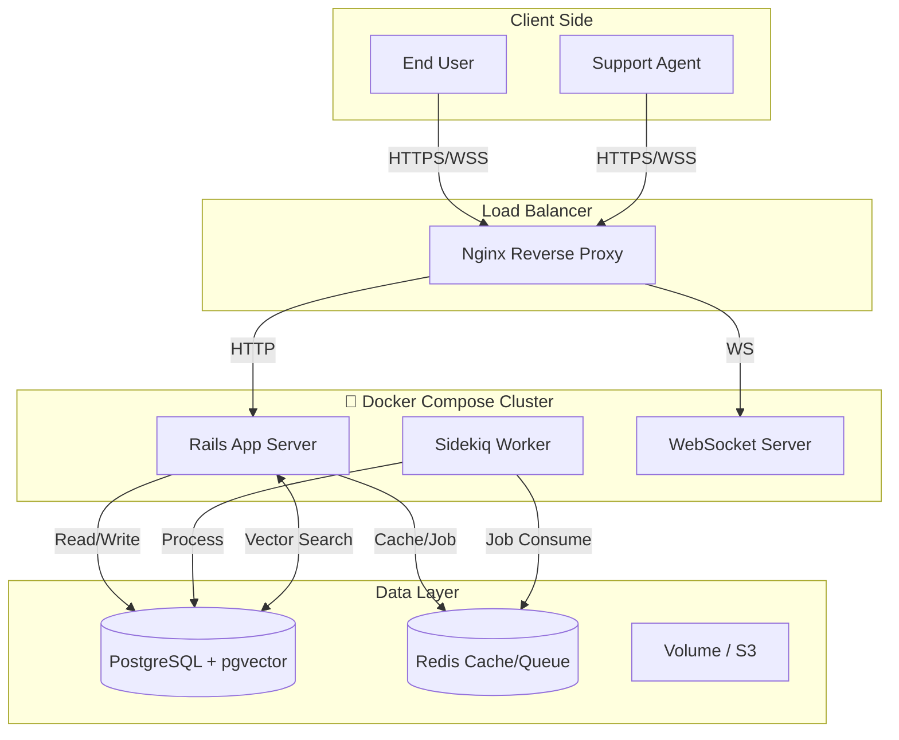
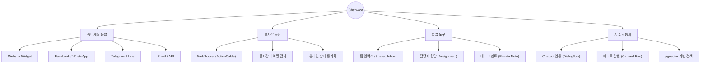

# 💬 Self-Hosted Chatwoot: Enterprise Customer Support Suite

> **"오픈소스의 자유로움 + 엔터프라이즈급 성능"**
>
> Docker 기반으로 5분 만에 구축하는 Omni-channel 고객 지원 플랫폼

<div align="center">

🔗 **Original Repo**: [Chatwoot GitHub](https://github.com/chatwoot/chatwoot) | 📚 **Deploy Guide**: [Documentation](https://www.chatwoot.com/docs/self-hosted)

</div>

---

## 📑 목차

- [프로젝트 개요](#-프로젝트-개요)
- [시스템 아키텍처](#-시스템-아키텍처)
- [핵심 기능](#-핵심-기능)
- [기술 스택](#-기술-스택)
- [트러블슈팅 및 최적화](#-트러블슈팅-및-최적화)
- [빠른 시작](#-빠른-시작-quick-start)
- [프로젝트 구조](#-프로젝트-구조)

---

## 📋 프로젝트 개요

이 프로젝트는 오픈소스 고객 지원 솔루션인 **Chatwoot**를 Docker Container 환경에서 **프로덕션 레벨**로 구축한 인프라 프로젝트입니다.

| 항목 | 내용 |
|------|------|
| **프로젝트명** | Chatwoot Self-Hosted Architecture |
| **구축 목표** | Docker Compose를 활용한 Zero-Downtime에 가까운 배포 환경 구성 |
| **핵심 가치** | **Data Privacy** (데이터 자산화), **Customization**, **Cost Saving** |
| **주요 구성** | App Server, Worker, DB(pgvector), Cache, WebSocket |

---

## 🏗 시스템 아키텍처



---

## ✨ 핵심 기능



### 1. 🔄 실시간 옴니채널 메시징
- 웹 위젯, 페이스북, 트위터, 라인 등 다양한 채널을 하나의 **통합 인박스(Inbox)**에서 관리
- **ActionCable(WebSocket)** 을 통해 딜레이 없는 양방향 통신 구현

### 2. 🤖 AI 및 자동화 준비 (pgvector)
- PostgreSQL의 **pgvector** 확장을 활성화하여 RAG(검색 증강 생성) 및 AI 봇 연동을 위한 벡터 데이터베이스 환경 구축

### 3. ⚡ 고성능 비동기 처리
- **Sidekiq + Redis** 조합으로 이메일 발송, 웹훅 처리, 리포트 생성 등 무거운 작업을 백그라운드에서 비동기 처리하여 웹 서버 부하 최소화

---

## 🛠 기술 스택

| 컴포넌트 | 기술 | 버전 | 선정 이유 (Why?) |
|----------|------|------|------------------|
| **App Server** | Ruby on Rails | 7.1.5 | 빠르고 안정적인 REST API 및 WebSocket 지원 |
| **Database** | PostgreSQL | 16 | ACID 트랜잭션 보장 및 pgvector AI 확장성 |
| **Cache/Queue** | Redis | Alpine | 고성능 인메모리 캐싱 및 Sidekiq 작업 큐 관리 |
| **Worker** | Sidekiq | 7.3 | 신뢰성 높은 백그라운드 작업 처리 (Retry 메커니즘) |
| **Infra** | DockerCompose | - | 개발/운영 환경 일치 및 간편한 배포/확장 |

---

## 🔧 트러블슈팅 및 최적화

### 1. 자산 컴파일(Asset Precompile) 속도 이슈
- **문제**: 초기 `docker-compose up` 시 Webpack 컴파일로 인해 부팅이 5분 이상 지연됨
- **해결**: 프로덕션용으로 미리 빌드된 Docker Image를 사용하도록 설정 변경, 로컬 볼륨 마운트 최적화

### 2. WebSocket 연결 실패 (CORS)
- **문제**: Nginx 리버스 프록시 뒤에서 WebSocket 연결이 끊어지는 현상 (400 Bad Request)
- **해결**: Nginx 설정 헤더 추가 및 Rails `config.hosts` 화이트리스트 등록

```nginx
proxy_set_header Upgrade $http_upgrade;
proxy_set_header Connection "upgrade";
```

### 3. Sidekiq 메모리 누수 방지
- **최적화**: `MALLOC_ARENA_MAX=2` 환경 변수를 적용하여 Ruby의 메모리 단편화 문제 완화 및 Sidekiq 프로세스 안정성 확보

---

## 🚀 빠른 시작 (Quick Start)

### 사전 요구사항
- Docker Desktop & Docker Compose
- Git
- 4GB RAM 이상 권장

### 1. 설치 및 실행
```bash
# 1. 저장소 클론
git clone https://github.com/your-username/chatwoot-setup.git
cd chatwoot-setup

# 2. 환경 변수 설정 (보안 필수)
cp .env.example .env
# .env 파일 내 POSTGRES_PASSWORD, SECRET_KEY_BASE 수정 필수

# 3. 데이터베이스 초기화 및 서비스 실행
docker-compose run --rm rails bundle exec rails db:chatwoot_prepare
docker-compose up -d
```

### 2. 관리자 계정 생성 (Rails Console)
```bash
docker exec -it chatwoot-web-1 sh

# 컨테이너 내부에서 실행
bundle exec rails c

# Rails 콘솔 입력
Account.create!(name: 'My Enterprise')
User.create!(email: 'admin@example.com', password: 'password123', name: 'Admin', role: 0)
```

### 3. 접속 확인
- **Admin Dashboard**: [http://localhost:3000](http://localhost:3000)
- **Test Widget**: `http://localhost:3000/widget_test` (자체 제작 테스트 페이지)

---

## 📁 프로젝트 구조

```
chatwoot-setup/
├── 📂 nginx/               # 리버스 프록시 설정
│   └── default.conf
├── 📂 storage/             # 영구 데이터 저장소 (Docker Volume)
│   ├── db/
│   └── redis/
├── 📜 docker-compose.yml   # 서비스 오케스트레이션 정의
├── 📜 .env.example         # 환경 변수 템플릿
├── 📜 README.md            # 프로젝트 문서
└── 📜 prepare_db.sh        # DB 초기화 스크립트
```

---

## 👨‍💻 인프라 엔지니어링 포인트

> **이 프로젝트는 단순한 앱 실행을 넘어 안정적인 운영 환경을 고려하여 설계되었습니다.**

- ✅ **Container Orchestration**: Web, Worker, DB 간의 의존성(`depends_on`) 및 헬스체크(`healthcheck`) 구성
- ✅ **Persistence**: Docker Volume을 활용한 데이터 영속성 보장 (컨테이너 재실행 시 데이터 유지)
- ✅ **Security**: `.env`를 통한 민감 정보 분리 및 내부 네트워크 격리

### 📜 License
This project setup guide is under MIT License.
Chatwoot itself is Copyright © Chatwoot Inc.

<div align="center">Infrastructure as Code (IaC) Practice Project</div>
